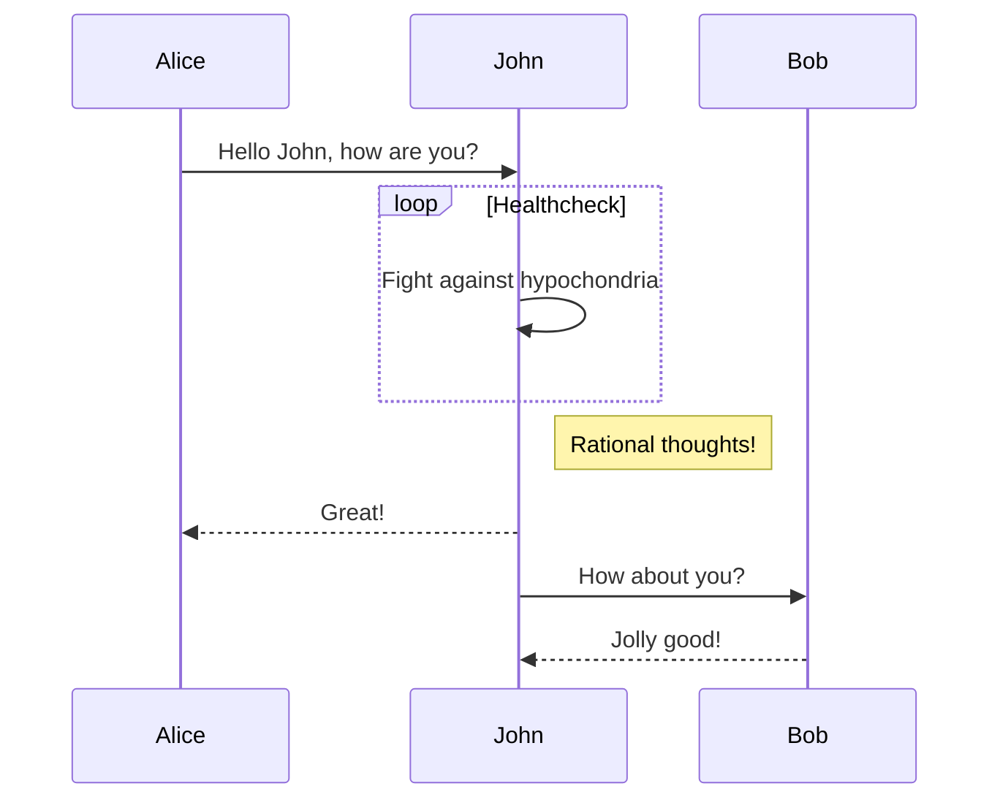
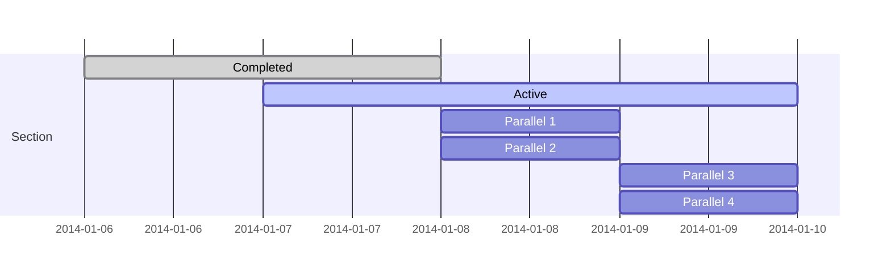
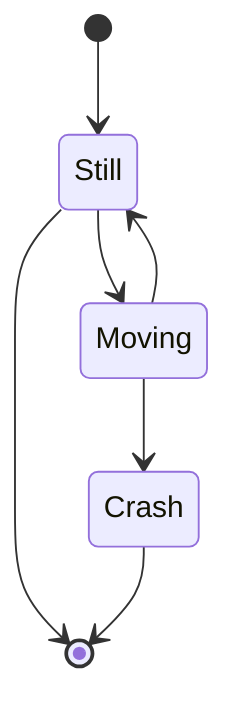
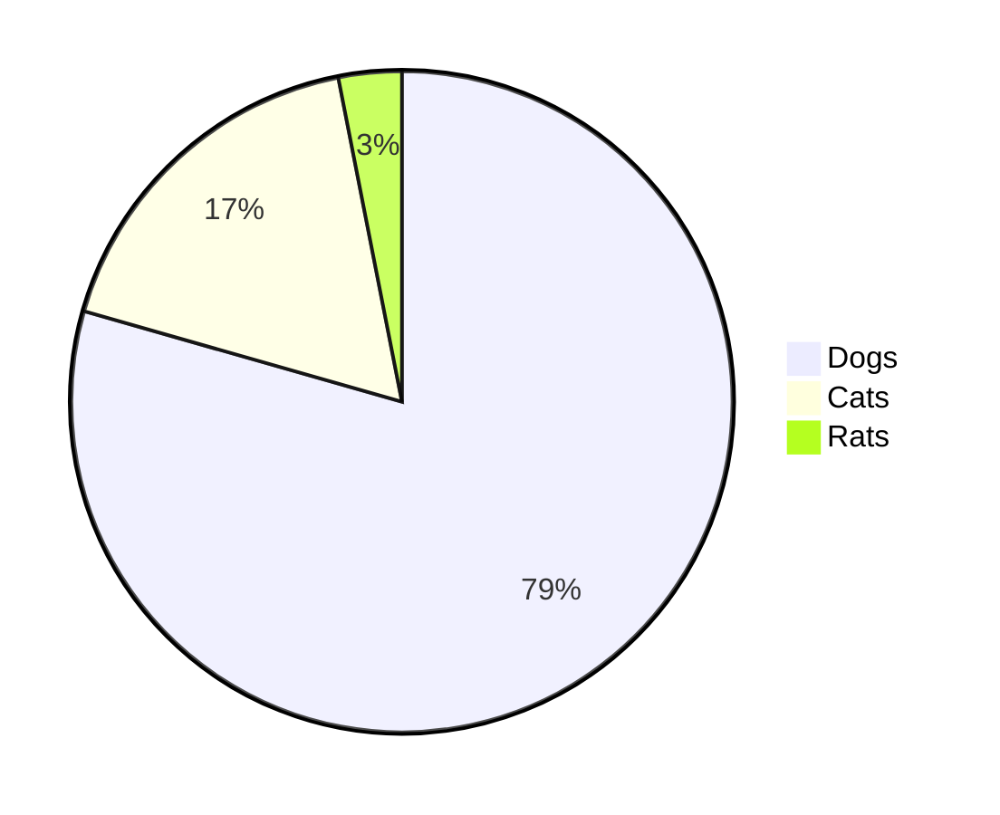
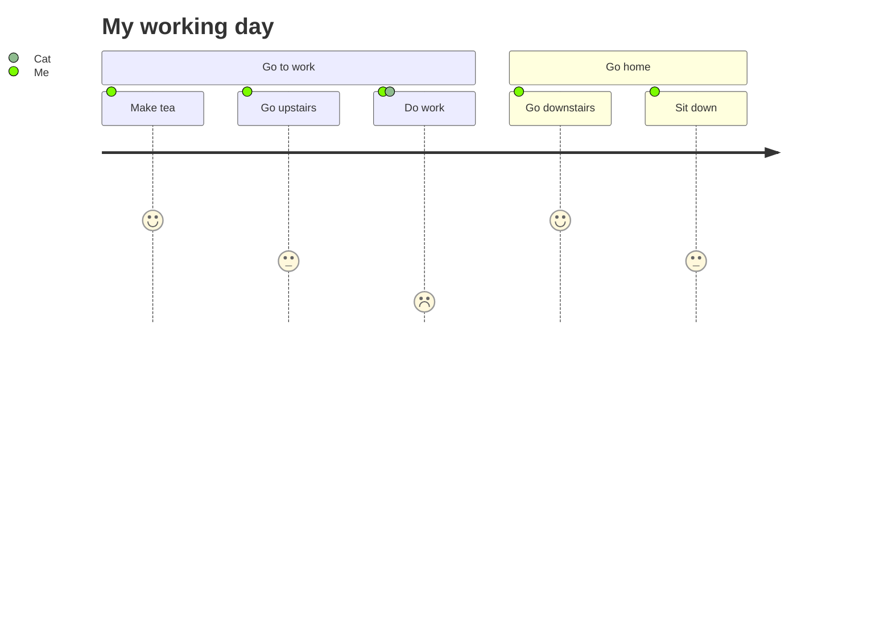

# H1 标题

## H2 标题

### H3 标题

#### H4标题

##### H5 标题

###### H6 标题

**加粗**

*斜体*

~~删除线~~

这是一段文本


`行内代码`

```
代码块
```

```python
print("代码高亮")
```


# 功能展示

## Font Awesome 6.1.0

**Solid:** <i class="fa-solid fa-house"></i> <i class="fa-solid fa-envelope"></i>

**Regular:** <i class="fa-regular fa-house"></i> <i class="fa-regular fa-envelope"></i>

**Light:** <i class="fa-light fa-house"></i> <i class="fa-light fa-envelope"></i>

**Thin:** <i class="fa-thin fa-house"></i> <i class="fa-thin fa-envelope"></i>

**Duotone:** <i class="fa-duotone fa-house"></i> <i class="fa-duotone fa-envelope"></i>

<link href="/css/thin.min.css" rel="stylesheet" type="text/css">

<link href="/css/light.min.css" rel="stylesheet" type="text/css">


## 警告系列

<div class="wr">
  <div class="t">
    警告
  </div>
  <div class="c">
    这是内容
  </div>
</div>

<br>

<div class="wo">
  <div class="t">
    橙色警告
  </div>
  <div class="c">
    这是内容
  </div>
</div>


<br>

<div class="wy">
  <div class="t">
    注意
  </div>
  <div class="c">
    这是内容
  </div>
</div>


<br>

<div class="wg">
  <div class="t">
    提示
  </div>
  <div class="c">
    这是内容
  </div>
</div>


<br>

<div class="wb">
  <div class="t">
    蓝色笔记
  </div>
  <div class="c">
    这是内容
  </div>
</div>

<br>

<div class="wp">
  <div class="t">
    紫色提示
  </div>
  <div class="c">
    这是内容
  </div>
</div>


<br>

<div class="wgra">
  <div class="t">
    信息
  </div>
  <div class="c">
    这是内容
  </div>
</div>


<br>


## 笔记系列


<br>

<div class="nr">
  红色笔记
</div>


<br>

<div class="no">
  橙色笔记
</div>


<br>

<div class="ny">
  黄色笔记
</div>


<br>

<div class="ng">
  绿色笔记
</div>


<br>

<div class="nb">
  蓝色笔记
</div>


<br>

<div class="np">
  紫色笔记
</div>


<br>

<div class="ngra">
 灰色笔记
</div>
<br>


## Mermaid JS

```markdown
	sequenceDiagram
    Alice->>John: Hello John, how are you?
    loop Healthcheck
        John->>John: Fight against hypochondria
    end
    Note right of John: Rational thoughts!
    John-->>Alice: Great!
    John->>Bob: How about you?
    Bob-->>John: Jolly good!
```




```markdown
  gantt
    dateFormat  YYYY-MM-DD
    section Section
    Completed :done,    des1, 2014-01-06,2014-01-08
    Active        :active,  des2, 2014-01-07, 3d
    Parallel 1   :         des3, after des1, 1d
    Parallel 2   :         des4, after des1, 1d
    Parallel 3   :         des5, after des3, 1d
    Parallel 4   :         des6, after des4, 1d
```





```markdown
  stateDiagram
    [*] --> Still
    Still --> [*]
    Still --> Moving
    Moving --> Still
    Moving --> Crash
    Crash --> [*]
```





```markdown
pie
	"Dogs" : 386
  "Cats" : 85
  "Rats" : 15
```





```markdown
journey
  title My working day
  section Go to work
    Make tea: 5: Me
    Go upstairs: 3: Me
    Do work: 1: Me, Cat
  section Go home
    Go downstairs: 5: Me
    Sit down: 3: Me
```





